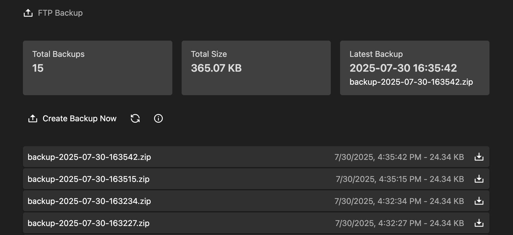

# Kirby FTP Backup

A Kirby CMS plugin that creates backups of your site content and uploads them to an FTP server.

[](https://github.com/tearoom1/kirby-content-watch)

***

## Features

- Create ZIP backups of your site content
- Automatic upload to FTP server
- Configurable backup retention
- Panel interface for manual backups and downloads
- Scheduled backups via cron job

## Installation

### Manual Installation

1. Download or clone this repository
2. Place the folder `kirby-ftp-backup` in your site's `/site/plugins` directory

### Composer Installation

```bash
composer require tearoom1/kirby-ftp-backup
```

## Configuration

All configuration is handled through Kirby's option system. Add the following to your `site/config/config.php` file:

```php
'tearoom1.kirby-ftp-backup' => [
    // FTP Connection Settings
    'ftpProtocol' => 'ftps',
    'ftpHost' => 'your-ftp-host.com',
    'ftpPort' => 21,
    'ftpUsername' => 'your-username',
    'ftpPassword' => 'your-password',
    'ftpDirectory' => 'backups',
    'ftpPassive' => true,
    'ftpPrivateKey' => 'path/to/private/key.pem',
    'ftpPassphrase' => 'your-passphrase',

    // Backup Settings
    'backupDirectory' => 'content/.backups',  // Local directory to store backups
    'backupRetention' => 10,                 // Number of backups to keep when using simple retention strategy
    'deleteFromFtp' => true,                  // Whether to delete old backups from FTP
    'filePrefix' => 'backup-',               // Prefix for backup filenames
    'retentionStrategy' => 'simple',         // Backup retention strategy: 'simple' or 'tiered'
    'tieredRetention' => [
        'daily' => 10,    // Keep all backups for the first 10 days
        'weekly' => 4,    // Then keep 1 per week for 4 weeks
        'monthly' => 6    // Then keep 1 per month for 6 months
    ]
]
```

### Configuration Options

| Option | Type | Default | Description                                                      |
|--------|------|---------|------------------------------------------------------------------|
| `ftpProtocol` | string | `'ftp'` | FTP protocol: 'ftp', 'ftps' or 'sftp'                            |
| `ftpHost` | string | `''` | FTP server hostname                                              |
| `ftpPort` | integer | `21` | FTP server port                                                  |
| `ftpUsername` | string | `''` | FTP username                                                     |
| `ftpPassword` | string | `''` | FTP password                                                     |
| `ftpDirectory` | string | `'/'` | Remote directory to store backups                                |
| `ftpPassive` | boolean | `true` | Use passive mode                                                 |
| `ftpPrivateKey` | string | `''` | Path to private key file                                         |
| `ftpPassphrase` | string | `''` | Passphrase for private key                                       |
| `backupDirectory` | string | `'content/.backups'` | Either absolute or relative (to Kirby base) path for local backups |
| `backupRetention` | integer | `10` | Number of backups to keep when using simple retention strategy   |
| `deleteFromFtp` | boolean | `true` | Whether to delete old backups from FTP server                    |
| `filePrefix` | string | `'backup-'` | Prefix for backup filenames                                      |
| `retentionStrategy` | string | `'simple'` | Backup retention strategy: 'simple' or 'tiered'                  |
| `tieredRetention` | array | see below | Settings for tiered retention strategy                           |
| `urlExecutionEnabled` | boolean | `false` | Enable URL-based backup execution                                |
| `urlExecutionToken` | string | `''` | Security token required for URL-based backup execution          |

### Retention Strategies

The plugin supports two retention strategies for managing old backups:

#### Simple Retention

Keeps a fixed number of most recent backups, discarding older ones. This is controlled by the `backupRetention` option.

```php
'backupRetention' => 10, // Keep 10 most recent backups
```

#### Tiered Retention

A more sophisticated approach that keeps backups with decreasing frequency as they age:

```php
'retentionStrategy' => 'tiered',
'tieredRetention' => [
    'daily' => 10,    // Keep all backups for the first 10 days
    'weekly' => 4,    // Then keep 1 per week for 4 weeks
    'monthly' => 6    // Then keep 1 per month for 6 months
]
```

This strategy:
1. Keeps all backups from the last X days
2. Then keeps one backup per week for Y weeks
3. Then keeps one backup per month for Z months
4. Deletes anything older

This provides a good balance between recent recovery points and long-term archiving.

## Panel Interface

The plugin adds a "FTP Backup" area to your Kirby Panel:

- View all available backups
- Create new backups manually
- Download existing backups
- View backup statistics (count, total size, latest backup)

## Automatic Backups with Cron

To set up automatic backups, add a cron job to your server. The cron job should run the included `run.php` script:

```bash
php /path/to/site/plugins/kirby-ftp-backup/run.php
```

Optionally the path to the kirby root directory can be passed as the first argument:

```bash
php /path/to/site/plugins/kirby-ftp-backup/run.php /path/to/root
```

The root directory is the one with the `kirby` folder inside.


### Example Crontab Entry

To run a backup every day at 2 AM:

```
0 2 * * * php /path/to/site/plugins/kirby-ftp-backup/run.php
```

Replace `/path/to/site` with the actual path to your Kirby installation.

### Using the Run Script

The `run.php` script handles:
- Creating a new backup
- Uploading the backup to the configured FTP server
- Cleaning up old backups based on the retention setting
- Outputs logs to the console

## URL-Based Backup Execution

As an alternative to cron jobs, you can trigger backups via HTTP requests. This is useful for:
- External monitoring services
- Webhook-based automation
- Manual triggering from remote systems
- URL based cronjob execution

### Configuration

First, enable URL execution and set a secure token in your `config.php`:

```php
'tearoom1.kirby-ftp-backup' => [
    // ... other settings ...
    'urlExecutionEnabled' => true,
    'urlExecutionToken' => 'your-secure-random-token-here',
]
```

### Usage

Once configured, you can trigger a backup by making a GET request to:

```
https://yoursite.com/ftp-backup/execute?token=your-secure-random-token-here
```

### Security Features

- **Token Authentication**: Requires a matching token to execute
- **Enable/Disable Toggle**: Can be completely disabled via configuration
- **Timing-Safe Comparison**: Uses `hash_equals()` to prevent timing attacks
- **Plain Text Response**: Returns simple status messages for easy monitoring

### Example Response

On success:
```
Backup created successfully: backup-2025-09-26-140236.zip
File uploaded to FTP server
```

On error:
```
Error creating backup: FTP connection failed
```

## Security Considerations

- Store your FTP credentials securely in your `config.php` file
- Make sure your `config.php` file is not accessible from the web
- Consider using SFTP or FTP with SSL for secure transfers
- Regularly verify that your backups are being created and can be restored

## Troubleshooting

If you encounter issues:

1. Check that your FTP credentials and server settings are correct
2. Verify that the FTP directory exists and has write permissions
3. Check your server's PHP error logs for any PHP errors
4. Make sure the local backup directory is writable by PHP
5. Check if you have the required PHP extensions (zip, ftp)

## Requirements

- Kirby 3.5+
- PHP 7.4+
- PHP ZIP extension
- PHP FTP extension

## Tests

The tests can be run with:

```bash
composer update
composer test
```

Make sure to cleanup the vendor after running tests, to remove dev dependencies.

```bash
composer dist
```

## License

This plugin is licensed under the [MIT License](LICENSE)

## Credits

- Developed by Mathis Koblin
- Assisted by AI Claude 3.7 Sonnet

[](https://coff.ee/tearoom1)
